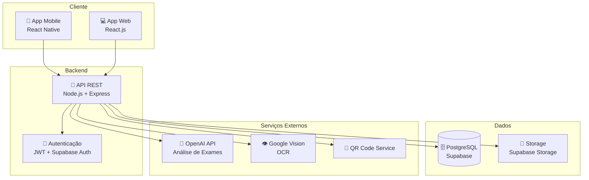
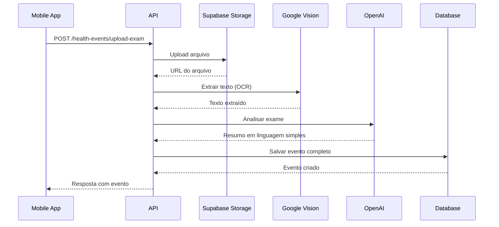
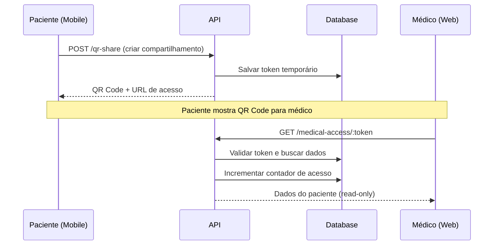
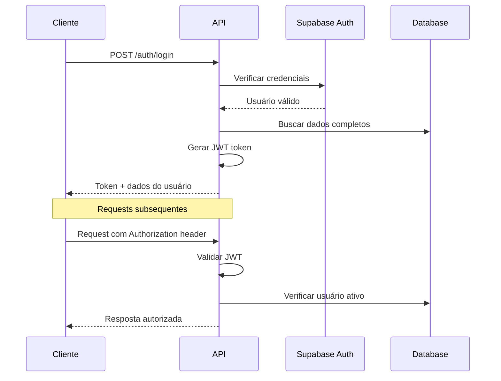

# 🏗️ Arquitetura do Sistema - VidaLink

Este documento descreve a arquitetura técnica do VidaLink, incluindo componentes, fluxos de dados e decisões de design.

## 📋 Visão Geral

O VidaLink é uma plataforma de saúde digital composta por:

- **App Mobile (Paciente)**: Interface principal para gerenciar histórico médico
- **App Web (Médico)**: Interface read-only para visualizar dados compartilhados
- **API Backend**: Servidor REST que gerencia dados e lógica de negócio
- **Banco de Dados**: PostgreSQL via Supabase para persistência
- **Serviços Externos**: IA para análise e OCR para digitalização

## 🎯 Arquitetura de Alto Nível



## 🔧 Componentes Principais

### 1. App Mobile (Paciente)

**Tecnologias:**
- React Native (Expo)
- TypeScript
- Expo Router (navegação)
- React Query (estado servidor)
- NativeWind (styling)

**Funcionalidades:**
- Cadastro e login de usuários
- Upload de exames com câmera/galeria
- Timeline de eventos de saúde
- Geração de QR Codes para compartilhamento
- Notificações push
- Acesso offline limitado

**Estrutura de Pastas:**
```
apps/mobile/
├── src/
│   ├── components/     # Componentes reutilizáveis
│   ├── screens/        # Telas da aplicação
│   ├── hooks/          # Hooks customizados
│   ├── services/       # Chamadas para API
│   ├── utils/          # Utilitários
│   └── types/          # Tipos específicos do mobile
├── assets/             # Imagens, ícones, fontes
└── app.config.js       # Configuração do Expo
```

### 2. App Web (Médico)

**Tecnologias:**
- React 18
- TypeScript
- Vite (build tool)
- React Router (navegação)
- Tailwind CSS (styling)
- React Query (estado servidor)

**Funcionalidades:**
- Acesso via token QR temporário
- Visualização read-only do histórico
- Interface otimizada para desktop
- Impressão de relatórios
- Sem persistência local (segurança)

**Estrutura de Pastas:**
```
apps/web/
├── src/
│   ├── components/     # Componentes React
│   ├── pages/          # Páginas da aplicação
│   ├── hooks/          # Hooks customizados
│   ├── services/       # Cliente da API
│   ├── utils/          # Utilitários
│   └── types/          # Tipos específicos do web
├── public/             # Assets estáticos
└── index.html          # Template HTML
```

### 3. API Backend

**Tecnologias:**
- Node.js + Express
- TypeScript
- Supabase (PostgreSQL + Auth + Storage)
- JWT para autenticação
- Winston para logging
- Multer para upload de arquivos

**Responsabilidades:**
- Autenticação e autorização
- CRUD de eventos de saúde
- Processamento de uploads (OCR + IA)
- Geração de tokens QR
- Rate limiting e segurança
- Integração com serviços externos

**Estrutura de Pastas:**
```
apps/api/
├── src/
│   ├── routes/         # Definição de rotas
│   ├── middleware/     # Middlewares customizados
│   ├── services/       # Lógica de negócio
│   ├── utils/          # Utilitários
│   ├── config/         # Configurações
│   └── types/          # Tipos específicos da API
└── logs/               # Arquivos de log
```

## 🗄️ Modelo de Dados

### Esquema do Banco (PostgreSQL)

```sql
-- Usuários
CREATE TABLE users (
  id UUID PRIMARY KEY DEFAULT gen_random_uuid(),
  email VARCHAR UNIQUE NOT NULL,
  password_hash VARCHAR NOT NULL,
  name VARCHAR NOT NULL,
  phone VARCHAR,
  date_of_birth DATE NOT NULL,
  cpf VARCHAR(11) UNIQUE NOT NULL,
  created_at TIMESTAMP DEFAULT NOW(),
  updated_at TIMESTAMP DEFAULT NOW()
);

-- Eventos de Saúde
CREATE TABLE health_events (
  id UUID PRIMARY KEY DEFAULT gen_random_uuid(),
  user_id UUID REFERENCES users(id) ON DELETE CASCADE,
  type VARCHAR NOT NULL, -- exam, consultation, vaccination, etc.
  title VARCHAR NOT NULL,
  description TEXT,
  date TIMESTAMP NOT NULL,
  attachment_url VARCHAR,
  ocr_text TEXT,
  ai_summary TEXT,
  doctor_name VARCHAR,
  institution VARCHAR,
  created_at TIMESTAMP DEFAULT NOW(),
  updated_at TIMESTAMP DEFAULT NOW()
);

-- Compartilhamentos QR
CREATE TABLE qr_shares (
  id UUID PRIMARY KEY DEFAULT gen_random_uuid(),
  user_id UUID REFERENCES users(id) ON DELETE CASCADE,
  token VARCHAR UNIQUE NOT NULL,
  doctor_email VARCHAR,
  expires_at TIMESTAMP NOT NULL,
  is_active BOOLEAN DEFAULT true,
  access_count INTEGER DEFAULT 0,
  max_access INTEGER DEFAULT 1,
  created_at TIMESTAMP DEFAULT NOW(),
  last_accessed_at TIMESTAMP
);

-- Índices para performance
CREATE INDEX idx_health_events_user_id ON health_events(user_id);
CREATE INDEX idx_health_events_date ON health_events(date);
CREATE INDEX idx_qr_shares_token ON qr_shares(token);
CREATE INDEX idx_qr_shares_expires_at ON qr_shares(expires_at);
```

## 🔄 Fluxos de Dados

### 1. Upload de Exame



### 2. Compartilhamento via QR Code



### 3. Autenticação JWT



## 🔐 Segurança

### Autenticação e Autorização

1. **JWT Tokens**:
   - Expiração: 7 dias
   - Assinatura com chave secreta
   - Payload mínimo (apenas user ID)

2. **Middleware de Autenticação**:
   ```typescript
   // Verificação em cada request protegido
   const token = req.headers.authorization?.split(' ')[1];
   const decoded = jwt.verify(token, JWT_SECRET);
   req.user = await getUserById(decoded.userId);
   ```

3. **Autorização por Recurso**:
   - Usuários só acessam próprios dados
   - Tokens QR têm escopo limitado
   - Rate limiting por IP

### Proteção de Dados (LGPD)

1. **Criptografia**:
   - HTTPS obrigatório em produção
   - Senhas com bcrypt (salt rounds: 12)
   - Dados sensíveis criptografados no banco

2. **Controle de Acesso**:
   - Tokens QR com expiração
   - Limite de acessos por token
   - Logs de auditoria (sem dados pessoais)

3. **Minimização de Dados**:
   - API retorna apenas campos necessários
   - Logs estruturados sem PII
   - Exclusão automática de tokens expirados

## 🚀 Performance e Escalabilidade

### Otimizações de Performance

1. **Banco de Dados**:
   - Índices em campos de busca frequente
   - Paginação em listagens
   - Connection pooling

2. **API**:
   - Cache de responses com Redis (futuro)
   - Compressão gzip
   - Rate limiting inteligente

3. **Frontend**:
   - Code splitting por rota
   - Lazy loading de componentes
   - React Query para cache de estado

### Estratégias de Escalabilidade

1. **Horizontal Scaling**:
   - API stateless (pode rodar múltiplas instâncias)
   - Load balancer (Nginx/CloudFlare)
   - CDN para assets estáticos

2. **Vertical Scaling**:
   - Monitoramento de recursos
   - Auto-scaling baseado em métricas
   - Database read replicas

## 📊 Monitoramento e Observabilidade

### Logging

```typescript
// Logs estruturados com Winston
logger.info('User action', {
  userId: user.id,
  action: 'upload_exam',
  duration: '1.2s',
  fileSize: '2.5MB'
});
```

### Métricas (Futuro)

- Response time por endpoint
- Taxa de erro por rota
- Uso de recursos (CPU, memória)
- Contadores de negócio (uploads, QR codes)

### Health Checks

```typescript
// Endpoint de saúde da API
GET /health
{
  "status": "healthy",
  "database": "connected",
  "external_apis": "operational",
  "uptime": "2d 5h 30m"
}
```

## 🔮 Roadmap Técnico

### Fase 1 (MVP - Atual)
- ✅ Estrutura básica do monorepo
- ✅ API com autenticação JWT
- ⏳ Upload e OCR de exames
- ⏳ Compartilhamento QR básico
- ⏳ Apps mobile e web funcionais

### Fase 2 (Melhorias)
- 📋 Push notifications
- 📋 Sincronização offline
- 📋 Análise IA mais avançada
- 📋 Relatórios em PDF
- 📋 Integração com wearables

### Fase 3 (Escala)
- 📋 Microserviços
- 📋 Event-driven architecture
- 📋 Machine Learning pipeline
- 📋 Multi-tenancy
- 📋 Compliance HIPAA

## 🤔 Decisões de Arquitetura

### Por que Monorepo?
- **Prós**: Compartilhamento de código, deploy coordenado, refactoring fácil
- **Contras**: Build times maiores, complexidade inicial
- **Decisão**: Benefícios superam custos para MVP

### Por que Supabase?
- **Prós**: PostgreSQL gerenciado, auth built-in, real-time, storage
- **Contras**: Vendor lock-in, menos controle
- **Decisão**: Acelera desenvolvimento, pode migrar depois

### Por que React Native (Expo)?
- **Prós**: Código compartilhado, desenvolvimento rápido, comunidade
- **Contras**: Performance vs nativo, limitações de APIs
- **Decisão**: Time-to-market é prioridade para MVP

### Por que JWT vs Sessions?
- **Prós**: Stateless, escalável, funciona bem com mobile
- **Contras**: Não pode ser revogado facilmente, payload size
- **Decisão**: Simplicidade e escalabilidade são prioridades 